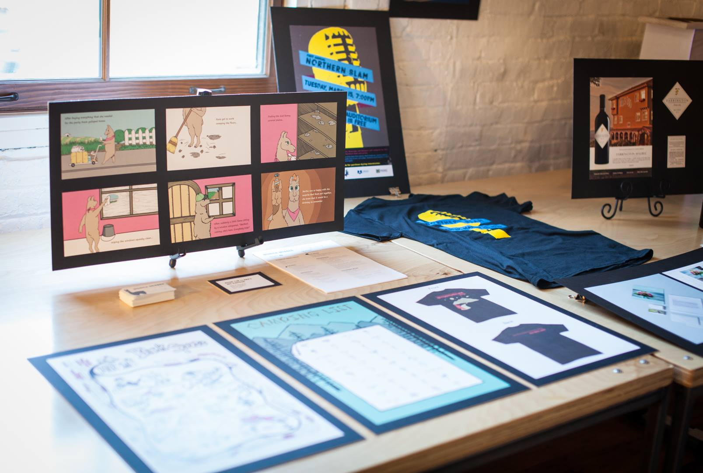

# Introduction

## **What even is Design?**

Milton Glaser, an industry renowned designer, marketer, and business professional, says

> "To design is to communicate clearly by whatever means you can control or master."

Design is communicating, and graphic design \(which is visually communicating\) is just one aspect of design. Design is problem-solving, storytelling, entertaining, marketing, advertising, and more.

## Fretting About the Future

There are numerous career paths you can pursue with a Design degree. You can be a Graphic Designer, Print Specialist, Marketing Expert, Entrepreneur, Digital Designer, Artist, Teacher, UX Designer, Web Designer, Social Media Designer, Experiential Designer, Event Planner, Set Designer. The sky isn't even the limit!

All of the possibilities with a design degree might seem overwhelming, so we encourage you to use the time you have now to explore the different avenues and aspects of design. Take classes that interest _you_. Talk to people you know and read about designers. Reach out to local experts. Most people are thrilled to talk to someone about their life \(people like talking about themselves\). Visit the EWU Career Center for resources on conducting an informational interview with an industry professional. Part of your education is discovering what you want for your life, and the best way to do this is to observe and experiment with different roles yourself.

## Tailoring Your Life

The EWU Design Degree is a fairly general start for your design journey. However, you can tailor the degree to fit your interests and career goals. You will work with your faculty advisor to choose classes to fulfill degree requirements and electives while also building specialized skills in a design area _you_ are interested in. Learn more about the DESN courses offered in the [University's course catalog](https://catalog.ewu.edu/science-technology-engineering-mathematics/design/design-bdes/).

## Choosing a Side Hustle

If you are interested in declaring a double major or minoring in a subject related to design, consider the following options. Then talk with your design advisor about how a minor or second major can help you reach your career goals. Below is a list of options that complement a design degree well.

[**Marketing**    
](https://www.ewu.edu/cob/finance-marketing/)A marketing degree can be a great option for developing design skills related to marketing. This degree can help you understand where your design will go and how they will be used after you finalize them.

[**Psychology**    
](https://www.ewu.edu/css/psychology/)Psychology is a great option to study along with design, as in the design field there is a lot of overlap with interpreting how your audience will respond to a design. The visual information processing and cognition classes would be extra beneficial.

[**Communications Studies**    
](https://www.ewu.edu/css/communication-studies/)Communication is a key skill for any field. A communications degree will help you gain organization and communication skills that will serve as a key asset throughout your professional career.

[**Technical Communication**    
](https://www.ewu.edu/cale/english/technical-communication/)A Technical Communication degree is a great compliment for a design major as it focuses more on readability, textual information design, and understanding how language structure affects and interacts with design decisions.

[**Business/Entrepreneurship**    
](https://www.ewu.edu/cob/management/entrepreneurship/)It would be hard for the field of design to exist without business. If you are interested in starting your own design firm or freelancing, this degree would be helpful for you to gain the skills necessary to make your dream a reality.

[**Computer Science**    
](https://www.ewu.edu/cstem/computer-science/)For those more interested in the design and technology, a computer science degree would complement a design degree well and set you apart from the competition.

[**UX Certificate**    
](https://www.ewu.edu/cstem/design/ux-certificate/)The User Experience Design Certificate is offered by the design program and is a great option to accompany the design major if you are interested in designing the interfaces of apps or websites, or if you are interested in becoming a front end designer/developer.

## Getting Your Tech Right

Most of the campus computers meet the required technical specifications for design classes. However, if you want to purchase your own computer for Design classes, make sure it meets the following requirements. _\*Chromebooks and other cloud based devices will NOT work.\*_

**RAM**  
16 GB minimum \(more preferred\)

**Hard Drive \(Storage\)**  
512 GB SSD or 750 GB/7200 RPM minimum \(more preferred\)

**Video Adapter \(Graphics Card\)**  
1 GB VRAM or more; animation students should consider 2 GB VRAM or more \(avoid integrated graphics processors\)

**External Hard Drive**  
An external drive at least as large as your computer's internal drive for backing up your computer.

**Warranty Service**  
It is recommended to purchase a warranty service lasting at least 3 years.

**Software**  
Microsoft Office 365 and Adobe Creative Cloud are required for design courses. Microsoft Office 365 is available through your EWU email. If purchasing Adobe Creative Cloud, be sure to check for educational discounts.

