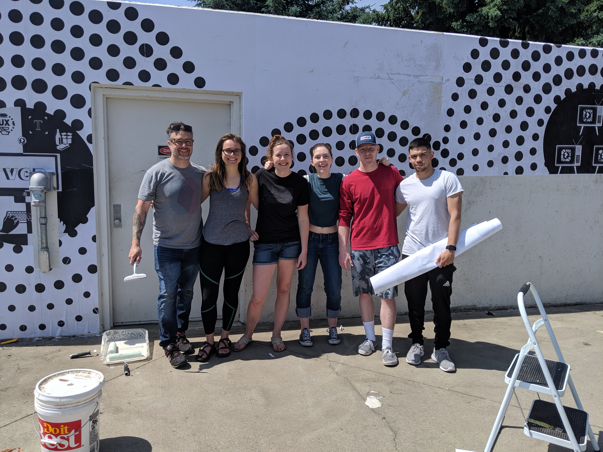
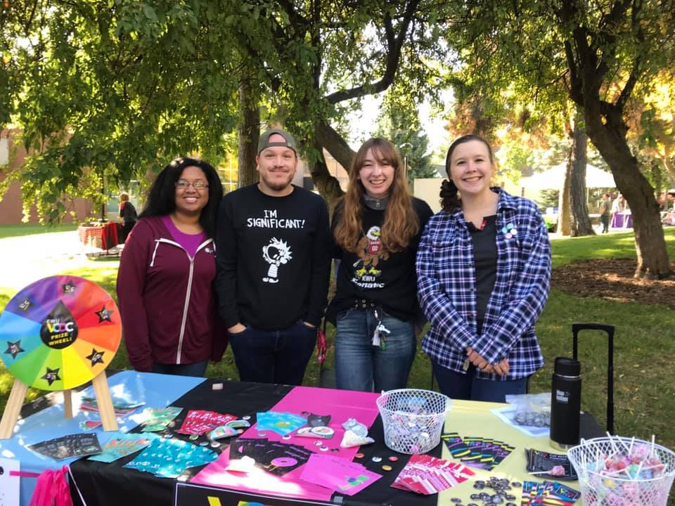

# Our Community

### **We Are On Point**

The EWU Design program has an amazing community. From professors to students, everyone wants to learn and grow together. So don’t be afraid to say “hi” to your neighbor, bring up the latest controversial design topic, or mention an interesting Medium article you read. Our community is open, collaborative, and ready to hear what you have to say and grow from it.

The Professors and Advisors care about _you_ and want you to take every learning opportunity you can while you are here.

Your fellow students are excited to learn with you and collaborate on class projects and assignments. Some of the most inspiring ideas come from conversations with others who have different perspectives and views on your ideas. Upperclassmen are eager to assist with lower-division classes and answer any questions. Don’t be afraid to seek out peer opinions.

### Semi-Organized Student Socializing

A great way to meet and collaborate with other design students is to participate in the EWU Design Club. The club meets weekly each quarter and works on different design projects, hosts peer critiques, portfolio workshops, and networking opportunities. The club also facilitates social events for design students typically in the form of Draw Offs and Holiday Parties. Be sure to join the club on Eagle Sync to stay up to date. Follow the club on Facebook and Instagram to stay up to date! 

* [**Instagram:** @ewu.design](https://www.instagram.com/ewu.design/)
* [**Facebook:** @VCDClub](https://www.facebook.com/VCDClub/)

### Been There Done That

Many program alumni are right here in Spokane! These folks love to chat with their old profs and see what the current students are up to. The best way to reach them is through the EWU Design Facebook Group. You can request to join the group [here](https://www.facebook.com/groups/vcd.ewu/?ref=bookmarks). These might be some of the most valuable connections you can make. Create these authentic connections now, before you need them. So once you start looking to gain experience, you already have a connection and you don’t have to cold call. You will quickly realize how valuable this network is, as many positions are filled before they are advertised due to word of mouth.

