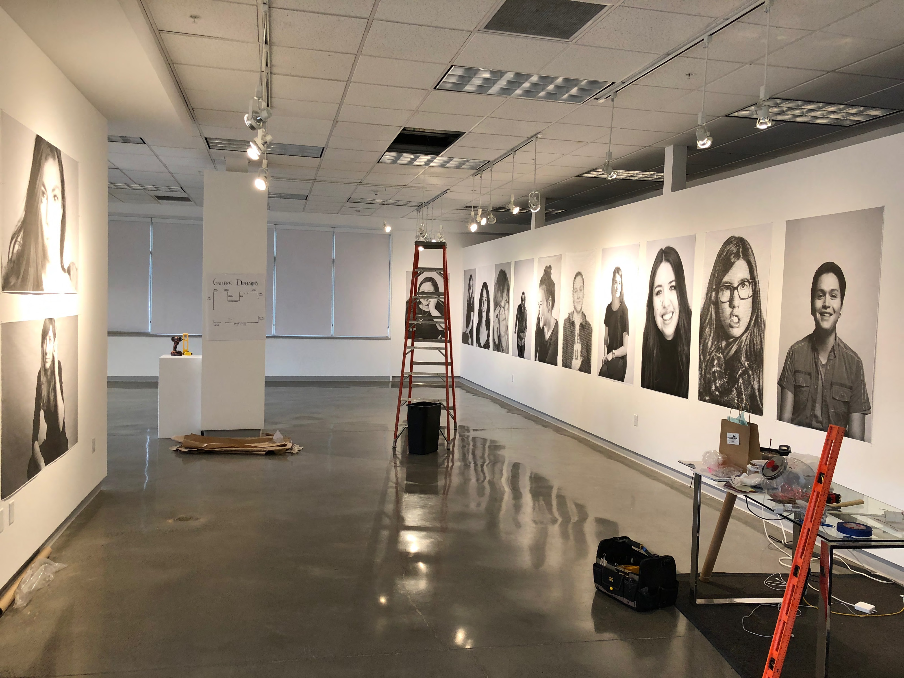
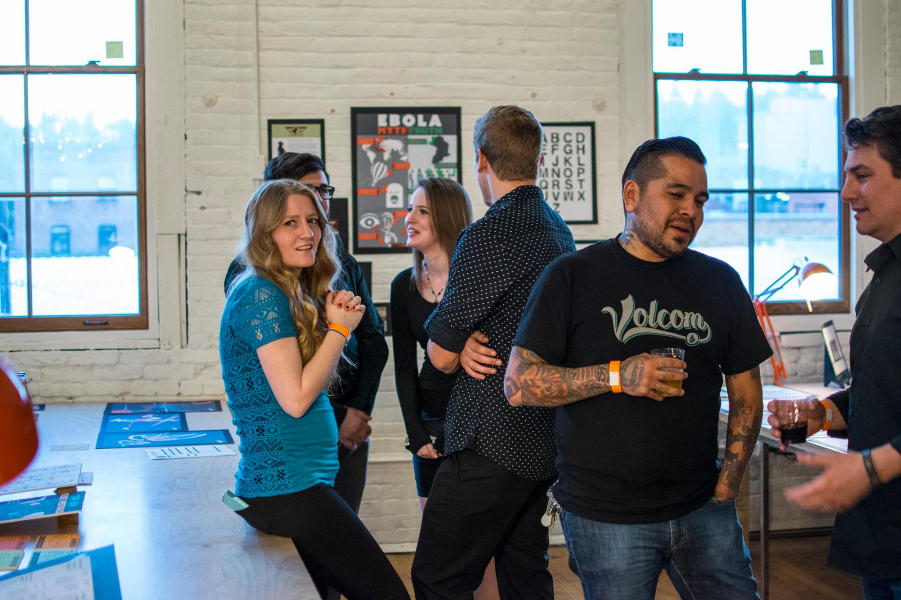

# Creating Your Own Path

Now that you’ve been introduced to the program and you know a bit about what to expect, it is up to you to make it your own. What you do with your time outside of the program is up to you. However, we encourage you to take advantage of the time you have now and start building a professional presence and network to set you up for success after graduation.

## Adulting Events

There are many organizations and events right here in Spokane that can help you build your professional network. It is a good idea to research each of these organizations, and follow the ones that interest you so you can stay up to date with what is happening in our local community.

[**American Advertising Federation Spokane \(AAF Spokane\)**](http://aafspokane.com/)  
AAF Spokane is a local chapter of the American Advertising Federation. They host several events and fundraisers throughout the year. Including, the American Advertising Awards, Create, and Collective Campout. They also offer volunteer opportunities and lunch and learn workshops. All of which are great opportunities to get out there and network. In addition to these opportunities, AAF also offers scholarships for college design students and seeks an EWU Student Liaison to serve on their board annually.

[**First Friday**](https://downtownspokane.org/first-friday/)  
First Friday is a program organized by the Downtown Spokane Partnership. On the first Friday of every month, local art galleries launch new art exhibits, host live musicians, and local restaurants offer discounts. These are great opportunities to see what the community is up to. Downtown Spokane also hosts a poster contest in the summer to gather designs to use throughout the First Friday season.

[**Future Ada**](https://futureada.org/)  
Futura Ada hosts technology-centered events and workshops throughout the year. Including Code in the Dark held annually in October. This is a great event to practice your web design skills alongside industry professionals. Futura Ada also offers career mentorships for women and non-binary students.

[**She is Vested**](https://www.sheisvested.com/)  
Vested is a professional networking group specifically for women entrepreneurs. Vested hosts monthly events to promote professional growth and community connection.

[**Spark Central**](https://spark-central.org/)  
Spark Central is a community organization and learning space that promotes creativity, innovation, and imagination through education and workshops. Spark Central also offers volunteer and internship opportunities.

[**Spokane Arts**](https://spokanearts.org/)  
Spokane Arts is a community organization existing to promote art and creativity in the inland northwest. Spokane Arts hosts and supports a variety of creative events throughout Spokane. In addition, they offer artist grants and curate a list of local artist opportunities.

[**Spokane Art School**](http://spokaneartschool.net/)  
SAS organizes community art classes and hosts art centered events, such as the annual Monster Draw in October. They are always looking for volunteers and regularly offer art residencies.

[**Spokane Print and Publishing Center**](https://www.facebook.com/spokaneprint/)  
SPPC is a local print center specializing in letterpress, screen-print, relief printmaking, book-binding, and other creative mediums. SPPC frequently offers classes to further your creative printmaking skills.

[**Spokane UX**](https://www.spokaneux.com/)  
Spokane UX is a local Meetup group with monthly meetings discussing the latest UX trends and local opportunities. These events are a great opportunity to make connections and practice discussing industry trends with other design professionals.

[**Spokane Young Professionals**](https://www.spokaneux.com/)  
SYP is a local networking group specifically for young professionals. While not specifically design-oriented, the SYP events are great ways to meet other professionals. Who knows, someone here might need an intern or have a job opening?

[**Terrain**](https://www.terrainspokane.com/)  
Terrain is a local art gallery and non-profit that hosts the annual art show Terrain, bi-annual craft fairs Bazaar and Brrzaar, as well as First Friday events throughout the year. EWU Design students and graduates have exhibited work at the Terrain art show and have been accepted to table at Bazaar. Keep an eye out for when the applications open for Terrain events.

## Getting Out

Getting there is the hardest part. Set a goal for yourself to attend one event every month, or every 2 weeks, whichever fits your schedule. Then, make sure to go prepared. Take business cards with your contact information, portfolio link, and any professional social media profiles you would like to share. LinkedIn is a great tool to use for connecting with professionals. People can lose business cards or resumes, but a LinkedIn connection can help keep you in the forefront of someone’s mind; especially if you are actively engaging with their content. Take copies of your resume, if relevant to the event. Then prepare for the actual networking part.

## \#Goals

An elevator pitch is a brief summary of who you are, what you are currently doing, and what you hope to do in the future. Think about being on an elevator with your favorite designer. How would you describe yourself to them? How would you explain your experiences? And how would you express your hopes for your future? Practice your elevator pitch and get feedback from your advisors and mentors. Revise your pitch based on their feedback. Then practice your pitch until you are confident in your delivery.

## Talking to Strangers

You might feel awkward going to an event as a student. But here is the secret: _Everyone is feeling a little awkward_. Making conversation with people you don’t know is hard. But networking events are great because talking to others you don’t know is expected - in fact, that is why everyone is there. They want to meet people and connect. The simplest way to start a conversation is to introduce yourself and then ask someone what they do for work. You can always have other questions to help build the conversation:

* “That’s great, what company do you work for?”
* “How long have you been there?”
* “How long have you been doing that?”

Once you ask the questions, be an active listener. Inquire further about projects, activities, and personal hobbies. Show you are interested in connecting with them through your actions and body language. The best connections made are the ones where you discover shared interests and common goals. If you are attending an event that you have access to the attendance list, consider researching attendees to help you build connections and conversation.

## Be Ready to Brag

Be ready to talk about yourself. Use your elevator pitch and show excitement when you are discussing your own projects and professional goals. Stay mindful of how you are doing throughout the event. Remember it is okay to take breaks; you don’t have to be “on” the whole time. You perform your best when you are relaxed and confident; if you need a social break, take a moment to get a drink of water or visit the refreshment table \(if there is one\). Then when you are refreshed, jump back into “networking mode”. At the end of the event, ask to connect with other attendees on LinkedIn or offer your business card; better yet, get theirs.

## \#Fearless on Campus

There are many opportunities to network and gain experience right here on the Eastern Campus. Connect with the EWU Career Center to see current job openings and events. The annual events below are great places to start:

* STEM Career Fair, Fall Quarter
* FUSE Career Fair, Winter Quarter
* SOAR Conference, Spring Quarter

Stay up to date on Handshake for internship and job opportunities on campus that relate to design. Historically the EWU offices below have hired design students as student graphic designers or marketing assistants:

* Athletics
* ASEWU
* Career Center
* The College of Social Sciences
* Eagle Store
* EPIC Adventures
* Housing and Residential Life
* Office of Diversity and Inclusion
* Office of Sustainability
* SAIL
* Student Affairs
* Student Employment

## \#Fearless in Spokane

There are also plenty of local industry opportunities in and around Spokane. Follow local creative firms on social media to be the first to know of student opportunities and check Handshake often. Below is a list of firms and local businesses that have regularly offered design internships or residencies:



* [14Four](https://www.14four.com/)
* [Bahlr Media](https://bahlr.com/)
* [Chapter and Verse](https://www.chapterandver.se/)
* [Desautel Hege - DH](https://www.wearedh.com/)
* [Gravity Jack](https://gravityjack.com/)
* [Klundt Hosmer](https://klundthosmer.com/)
* [Marketing Vision](https://marketvisionads.com/)
* [Mojo Labs](https://mojo-lab.com/)
* [Seven2](https://seven2.com/#/)
* [The Woodshop](https://thewoodshopnw.com/)



* [ENGIE Impact](https://www.engieimpact.com/)
* [Etailz](https://www.etailz.com/)
* [Inlander](https://www.inlander.com/spokane/InternshipsFreelancing/Page)
* [Itron](https://www.itron.com/)
* [McKinstry](https://www.mckinstry.com/)
* [RiskLens](https://www.risklens.com/)
* [SCAFCO Steel Stud Company](https://www.scafco.com/)



* [Future Ada](https://futureada.org/)
* [Laboratory](https://laboratoryspokane.com/)
* [Northwest Museum of Arts and Culture](https://www.northwestmuseum.org/)
* [Spark Central](https://spark-central.org/)
* [Spokane Art School](http://spokaneartschool.net/)
* [Spokane Valley Heritage Museum](http://www.spokanevalleymuseum.com/) 



## \#Fearless Away

While there are some opportunities locally, there are so many summer positions if you are willing to relocate. If you are concerned about cost, usually away opportunities are paid! No place to live? Thanks to the worldwide web there are numerous temporary housing options or services to connect you with someone in need of a sublet. The next section goes into detail with tips on securing a summer internship away from Spokane \(although the same tips can land you a local position too!\).

