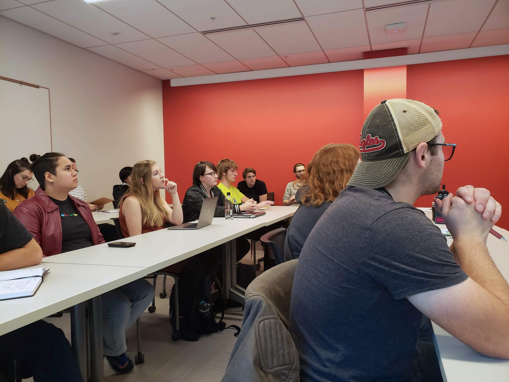

# Gaining Experience

### G.Y.S.T.

Figure out why you want an internship or job. What are your goals for the position? What do you want to learn from it? Is there a specific area of design you want to learn more about? Once you have a clear picture of what you want, it is time to start looking.

### Shazam Your **Portfolio**

Once you have an idea about what kind of work you want to do, make sure your portfolio reflects this goal. Make sure to include your best portfolio pieces. If there is work you previously were confident in, but I don’t feel like reflects your talents today, don’t be afraid to take this out. Also, be sure to only include work that you actually want to do in a job. If you do NOT want to be hired as a photographer, don't include a bunch of photography. If you DO want to be hired as a UX Designer, include as many UX projects as possible. You'll be hired for what you show you understand and are skilled in.

### Get a Jump Start

Start your search in the fall. Bigger companies start posting positions anywhere between October and January for summer openings, with an increasing number of postings during late February through April. Keep your goals and desires for the experience at the forefront of your mind. Once you start looking outside Spokane, there are numerous opportunities - but also many more candidates to compete with. But don’t doubt yourself, you ARE qualified to apply and you CAN secure an internship. Narrow your search to a select 3 to 5 cities to help filter the overwhelming number of openings. Make a list of ten companies you think you’d like to work for. Then go to their websites to see what internships they have open. Search Handshake, LinkedIn, Indeed, and even just Google. Save the positions that excite you the most when you read about them, taking special note of any application deadlines.

### Take The Leap

Now with an organized list of opportunities, start applying. Schedule out time to work on your applications. Start with the one that is due the soonest, then work forward. Always include a cover letter; if there isn’t a place to upload one, add it as the first page of your resume.

TIP: Use a screen capture plugin to save the job description so you can reference it later. Some companies will take down the posting before scheduling interviews, and you might need to reference it to prepare for an interview!

### Your History

When writing your resume and cover letter, focus on the skills the internship posting lists as qualifications or requirements. Organize your skills by grouping technical ones together and then listing soft skills separately. When describing job roles and activities, focus on how you grew from a role and what you learned. Pull keywords from the listing and incorporate them into your resume and cover letter. In today’s ever-advancing world of technology, the first round of resumes are sometimes filtered by rules and algorithms searching for specific search terms related to the posting.

### Your Statement

Use your cover letter to introduce yourself, highlight specific information in your resume that you don’t want your audience to miss, and anything else that is relevant. Structure it in three to five paragraphs. Include who you are, why you want the role, why you are qualified for the role, and what they will get upon hiring you. When describing your skills quantify your experience, by stating how many years, hours, or projects you have been practicing a skill. EWU has several resume and cover letter writing services that may be beneficial to take advantage of. Visit the Career Center for tips on drafting your application documents.

### Suit Up

Congrats! Your application caught someone’s eye. When this happens, you will usually get an email from a recruiter requesting to set up a short phone call. These calls are preliminary checks to make sure you understand what the role you are applying for is and to answer any high level questions you have about the position. Before the call, make a list of a few questions to ask about the position and company. Below are a few ideas:

* How big is the team I would be working with?
* What types of projects have interns \(or Jr. staff\) completed in the past?
* Will there be any other interns / Jr. staff at the company?
* How many senior designers will be available to mentor throughout the internship?
* What teams will I be working with in this position? Marketing? Developers?
* Is intern housing provided?
* Are relocation costs offered?
* What is the salary?
* What are the chances of a job offer at the end of the internship term?
* How fluid is internal career advancement?

Remember, this call is as much for you as it is for them. You want to make sure you will be compensated for the time you are spending and the skills you already have. Be confident and value yourself.

### Prepping For the Hot Seat

After the call with the recruiter, you will get an email requesting to schedule a phone, video, or in person interview. Once the interview is set up, it’s time to prep. First, come up with a salary rang; base this off industry averages, your professional value, and your personal living expenses. You want to be prepared in case you are asked about your salary expectations. Next, review the job posting and research the company or team you will be working with. Find articles about past projects and find the interviewers on LinkedIn. Come up with two or 3 questions to ask the interviewer to show your interest in the company and position. Practice your answers for basic interview questions and how you would explain relevant projects in your portfolio. Contact the EWU Career Center to schedule a mock interview and develop your skills or use [https://ewu.biginterview.com/](https://ewu.biginterview.com/).

### The Hot Seat

If the interview is a phone or video call, make sure you are in a professional and quiet space.

Remember to stay calm and breath. Dress professionally, or as otherwise directed by the recruiter; you want to make a statement that you care about your presentation and are interested in the company. Feel free to bring a list of brief notes or questions to help you stay focused and remember what you practiced. If you are asked a question you don’t have an answer for, stay collected and be honest. After explaining you haven’t been in that situation or you are not sure how to accomplish the task, volunteer details on how you think you would handle the situation if you came across it in the future. Being honest shows humility, and describing how you would solve the problem shows how you approach problem solving and confidence that you can adapt to new situations. At the end of the interview, it is a good idea to ask about the next steps in the interview processes, or about the timeline on when you might hear back from the company.

### Push a Little

After an interview, it is important to follow up with the interviewer. Some companies will delay sending out acceptance notices just to see which applicants are interested enough in the position to follow up. We recommend sending a handwritten thank you note the following day, or at least an email expressing your gratitude for the interview.

If you have not heard from them by the time they stated they’d get back to you, or 5 business days \(whichever is sooner\), follow up with an email or phone call. Be courteous and respectful of their time, but also inquire about how the application process is going. Don’t be afraid to ask if you are still being considered for the position.

### Get a Drink!

Congrats! You got a job offer! Now all that is left to do is decide if you want to accept the position or not. Remember it is okay to take some time to think about the offer before accepting, but make sure you communicate your intentions. Often it is wise to start by asking the company if their offer is negotiable. Then consider your living expenses, your professional value, the benefit package, relocation costs, and average industry salaries.

Consider your professional experience; do you feel the offer is valuing you at industry standard? Research average salaries for entry level positions, and talk to your mentors to get advice on what are fair current salary standards. Don’t forget to look at your benefit package. Consider what you want in a health insurance plan, life insurance, retirement contributions, schedule flexibility, vacation time, sick leave, and transportation stipends. After your research is done, if you feel you are getting a fair offer, it is still okay to negotiate your salary and benefits package. Often it is harder to get a salary increase after being hired, than negotiating before you start. However, if they already mentioned the offer was non-negotiable, it is better to answer with a direct acceptance or denial of their offer.

If you decide to ask for more than the original offer, it is important to have a reason. Focus on how you have been a key participant or leader in past experiences, and how you will transfer that skill to your new position. Be informed and confident in your request; but, don’t be greedy. Value yourself but stay humble. If you are denied the request, the company will usually come back with a better offer than the original or they will give you a chance to reconsider the original offer.

### Spread Your Wings

If you’ve landed a summer internship or temporary contract position, chances are you’re on your own to find housing. If you’re lucky, your company might assist with relocation and housing placement, but for the majority of entry level positions, this is not the case. So where do you start? Thanks to the internet, there are plenty of online services that you can use to secure housing. Search Google for “intern” or “student” housing to see results. Some cities have complexes specifically dedicated to provide accommodations for students and interns. Check local college campuses to see if you can rent a dorm room during your stay. Research apartment complexes near where you will be working to see what the minimum lease requirement is and if they offer furnished rooms. For lower cost options, many cities have local Facebook sublet groups you can join to find a room or host family. You can also try Craigslist, Airbnb, College Student Apartments, and other online tools. Don’t be afraid to also inquire with your new employer about local housing resources, most are happy to help assist with relocation technicalities.

